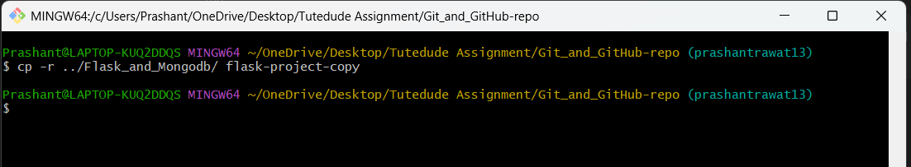
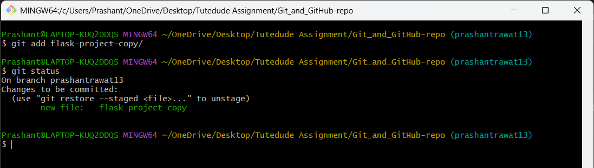
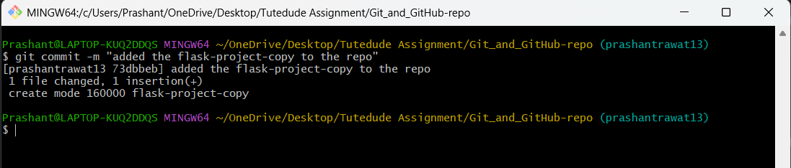
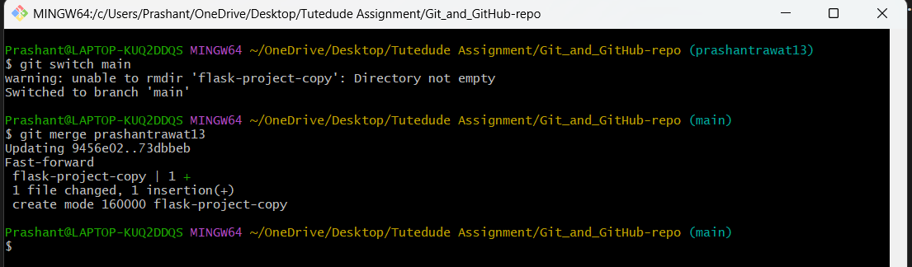

Today we'll be Doing some Task on Git and Github.


# Task 1 . Create a new GitHub repository.

### a. Clone the repository to your local machine using SSH (generate an SSH key if needed, add the public key to your GitHub account). 


Firstly we'll be starting with making a GitHub repository in our git-hub account


- We have created an repository named "[Git_and_GitHub-repo](https://github.com/Prashantrawat13/Git_and_GitHub-repo)"

- Now we'll be making the **clone of this repo in our Local Machine**

	- Now comes the Question How do we clone the repository from Github account to local..?
  
		- First we Click on the `<> Code` button and then Copy the HTTPS link.


-  Now that we have our HTTPS link of the repo, now we'll make an `Folder` for the repo.
	
	-  Then name of the folder can be anything.
	
	- But we are naming it as **Git_and_GitHub-repo**, using the command `mkdir : make directory`.

	- After making the directory we can go into the directory using the `cd : change directory` command


  
  
- And now we have checked inside of the directory using `ls : list` command and it's empty.

Now to clone the repository we first have to **Initialize Git in the directory** using `git init` command.


After Initialization We have to **Clone the repo** and we'll be using this command.

```
git clone https://github.com/username/repository-name.git

{In the link we have to paste the link from the github account we copied earliar}
```


***


  

### b. Create a new branch named after your username (e.g., Tutedude).

Now we'll be creating a `New Branch` name - **prashantrawat13**

```
git branch -c "branch-name"
```

Now to switch to the branch we'll command

```
git switch branch-name
```


To see all the branches there are and the current branch you are in:

```
git branch
```

***

### c. Add your Flask project files to this branch.

Now we'll add our flask project file in this directory

```
cp -r ../Flask_and_Mongodb/ flask-project-copy
cd -r "file-path" "name-for-file"
```

Now it is named as **flask-project-copy** {it's my another [git-repo](https://github.com/Prashantrawat13/Flask_and_mongodb.git)}



***


### d. Commit the changes and merge the branch into the main branch.

Now we'll make the changes from the "prashantrawat13" branch and then merge it with the main branch.


1.  Add the **flask-project-copy** to the git using the command :

	-  `git add flask-project-copy`

2.  We can check the status to know if it's added or not : 

	-  `git status`
 


3.  Let's commit the changes we made using the **prashantrawat13 Branch** 

	-  `git commit -m "added the flask-project-copy to repo"`



4.  Now then to merge the branch and the main we've to first switch to main branch.

	- `git switch main`

5.  Let's merge both of them now,
   
	- For that we'll be using the command :
  
	- You can put your branch name there.
  
	- `git merger prashantrawat13`




***
***


